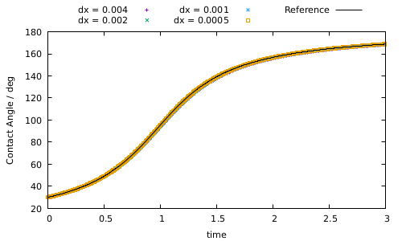
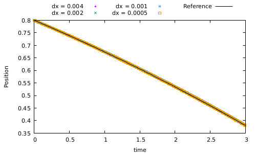
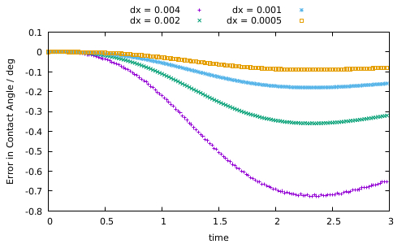
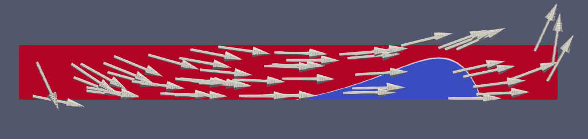
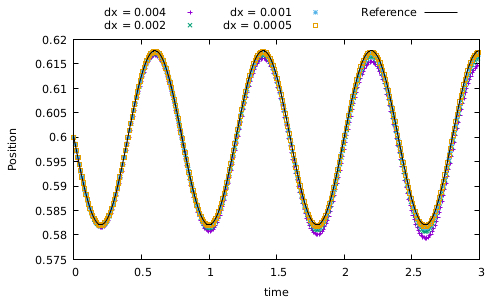
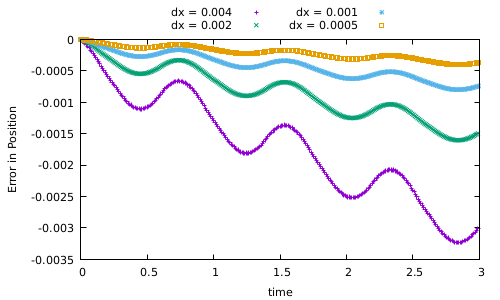

# Contact Line Advection using the Level Set Method

This demonstrator software uses a Finite Volume based discretization of the hyperbolic level set transport equation to solve for the evolution of an interface being in contact with the domain boundary. The present implementation has been used to produce the results in the manuscript [1], which will be published in the Proceedings in Applied Mathematics and Mechanics (https://onlinelibrary.wiley.com/journal/16177061). An additional publication concerning the contact line advection with the Volume-of-Fluid method is in preparation [4].

Within the level set method (see, e.g. [5]), the interface is represented as the zero contour of some smooth function, i.e. the interface at time t is given as the set

\f[ \Sigma(t) = \{x \in \Omega: \phi(t,x) = 0 \}. \f]

The interface is advected by a prescribed velocity field v according to the evolution equation

\f[ \partial_t \phi + v \cdot \nabla \phi = 0. \f]

This problem emerges from the discretization of continuum models for dynamic wetting, where the velocity field is a solution of the two-phase Navier Stokes equations. Here we are interested in the time evolution of both the *contact line*, i.e. the line of contact of the interface and the domain boundary, and the *contact angle* which is the angle of intersection between the interface and the boundary. In the Journal publications [2] and [3], we proved a fundamental kinematic relationship between the rate of change of the contact angle and the transporting velocity field. The kinematic evolution equation serves as a reference to validate the numerical solution of the level set equation in terms of the contact line position and the contact angle. 

The method is capable of solving the transport equation in both two and three dimensions, while the automatic evaluation of the contact angle over time is currently only implemented for the two-dimensional case.

**Note**: A html version of this documentation is available, see [readme.html].

### Authors of the software
* Mathis Fricke (fricke@mma.tu-darmstadt.de), Mathematical Modeling and Analysis, TU Darmstadt, Germany
* Tomislav Marić (maric@mma.tu-darmstadt.de), Mathematical Modeling and Analysis, TU Darmstadt, Germany
* Aleksandar Vučković (aleksandar.vuckovic@stud.tu-darmstadt.de), Student at Mathematical Modeling and Analysis, TU Darmstadt, Germany

### References
* [1] M. Fricke, T. Marić and D. Bothe: Contact Line Advection using the Level Set Method, Proceedings in Applied Mathematics and Mechanics, accepted for publication
* [2] M. Fricke, M. Köhne and D. Bothe: A Kinematic Evolution Equation for the Dynamic Contact Angle and some Consequences. Physica D: Nonlinear Phenomena, 394:26–43, [https://doi.org/10.1016/j.physd.2019.01.008] (2019)
* [3] M. Fricke, M. Köhne and D. Bothe: On the Kinematics of Contact Line Motion, Proceedings in Applied Mathematics and Mechanics, [https://doi.org/10.1002/pamm.201800451] (2018)
* [4] M. Fricke, T. Marić and D. Bothe: Contact Line Advection using the geometrical Volume-of-Fluid Method, in preparation
* [5] Y. Giga: Surface Evolution Equations: A Level set Approach, in: Monographs in Mathematics, vol. 99, Birkhäuser, Basel, [http://dx.doi.org/10.1007/3-7643-7391-1] (2006)
* [6] R. J. LeVeque. Finite Volume Methods for Hyperbolic Problems. Cambridge University Press, Cambridge, [https://doi.org/10.1017/CBO9780511791253] (2002).

Note that [2] is also available on the arXiv preprint server, see [https://arxiv.org/abs/1810.00830].

## Installation

### Dependencies
The software is most easily compiled on a Unix system using the GNU compiler. It has also been tested successfully on Windows 10 using the *MinGW* project ([http://www.mingw.org/]).

* g++ (GCC) 6.1
* make
* ParaView for Visualization

In order to rebuild the documentation from the source code, one further needs the software *doxygen* which is available for all platforms (see [http://www.doxygen.nl]).

### Compiling the software

On a Unix system enter the src/ directory and run make:

    cd src/
    make

If the program is compiled properly, you will find an executable called "cl_advection" in the src/ folder.

## Usage

To run the program, go to a testcase folder (containing a file named "Inputfile") and execute

    cl_advection

Within the same directory, you will find the files contactAngle.csv and position.csv. The first column represents the simulation time, the second is the actual value and the third is the reference value.
You will find a folder named data/ as well. It will contain the binary files of the field, its level set value, velocity field and the XMF file necessary to visualize everything in Paraview (version 5.5 and higher).

### Inputfile

All parameters in the Inputfile need to be set in order for the program to work correctly.
The physical parameters have arbitrary units.

Variable name | Description
---------------|-----------
numX, numY, numZ| Number of cells in the given direction.
lenX, lenY, lenZ| Length of simulation domain in the coordinate directions.
time | The total simulation time.
CFL  | Courant-Friedrichs-Lewy-number (determines the numerical timestep). CFL has to be set between 0 and 1 to ensure stability of the numerical method.
writestepsFraction | Fraction of total timesteps that will be written to disk.
writeField| Whether to write the level set field binary files to disk. The files contactAngle.csv and position.csv are always written (see below).
field | The velocity field that is used to transport the interface. By default, the possible choices are "navierField", "shearField", "timeDependentNavierField".
v0, c1, c2 |  The field parameters. For the Navier field all three parameters are relevant, but for the shear field, c1 and c2 are ignored and only the value of v0 matters.
tau | Parameter for the field "timeDependentNavierField" (see examples below).
centerX, centerY, centerZ | The initial center of the droplet.
expcpX, expcpY, expcpZ, expAngle | The expected coordinates for the initial contact point and the expected initial contact angle. Those are used for the reference solutions.
trackedContactPoint | Whether to track the left or right contact point. Only applicable in 2D.

### Visualization
To visualize the data with *Paraview* [https://www.paraview.org], open the file "Phi.xmf" within Paraview. Choose "Xdmf Reader", then press "Apply". In order to visualize the interface, choose "Rescale to Custom Data Range" and select appropriate scaling values, e.g. -0.001 to 0.001. Now, select "Play" at the top.

To visualize the velocity field, choose the filter "Glyph", then change the Maximum Number of Sample Points (section "Masking") to a smaller value, e.g. 500. To ensure correct scaling of the vector field, choose "Scale Array" as "Velocity Field" and "Vector Scale Mode" as "Scale by Magnitude".

## Implementation

The numerical method is based on an Explicit Euler Finite Volume Method on a regular cartesian grid. The first-order upwind method is used to compute the numerical fluxes over the cell edges (see, e.g. [6] chapter 4.9).

The program is structured into six files.

File name  | Description
----------------------|------------------
main.cpp | Reads the Inputfile and handles the top-level loop which evolves the field with time.
Field.cpp/hpp | The fundamental field class. Each instance of field represents an equidistant grid of any type parameter.
LevelSet.cpp/hpp | This class extends Field, instantiated with "double" as its type parameter and obviously represents the levelset field.  It is contains most of the important methods such as \ref LevelSet::calculateNextTimestep "calculatedNextTimestep" and \ref LevelSet::getContactAngle "getContactAngle". An object of class LevelSet is instantiated at the beginning within the main() function.
VelocityField.cpp/hpp | An object of class VelocityField represents a chosen velocity field. It is aware of its parameters type (for example whether it is a shear field with v0 = 2) and the domain it is applicable on.
velocityFields.cpp/hpp | This is a library that contains the definitions of the velocity fields.
vecMath3D.cpp/hpp |  This is a library of operator overloads and functions for vector analysis.

### Adding a new velocity field

To add a new velocity field, add itself and its Jacobian matrix to the files *velocityFields.cpp* and *velocityFields.hpp*. Next, add the appropriate if-statement to the VelocityField::at member function.

## Examples

In the following, we will consider three examples and verify the numerical results with the kinematic evolution equation (see [2],[3])

\f[ \dfrac{D n_{\Sigma}}{Dt} = - (\nabla v)^{\intercal} n_{\Sigma} + \langle \nabla v \cdot n_{\Sigma}, n_{\Sigma} \rangle \, n_{\Sigma}, \f]

where \f$ n_{\Sigma} \f$ is the normal vector at the contact point and \f$ \dfrac{D}{Dt} \f$ is the Lagrangian derivative.

### Navier slip type field (src/testcases/navier)
The Navier slip field is given by

\f[ v(x,y) = (v_0 + c_1 x + c_2 y, -c_1 y), \f]

where \f$v_0, c_1\f$ and \f$c_2 \f$ correspond to v0, c1 and c2 defined above. As it is evident from the plots of the contact angle and position, the results of the simulation are in agreement with the analytic solution. The latter is given by

\f[ x_1(t) = x_1^0 e^{c_1 t} + \dfrac{v_0}{c_1} (e^{c_1 t} - 1), \qquad \theta (t) = \dfrac{\pi}{2} + \arctan(-\cot\theta_0 e^{2c_1 t} \pm c_2 \dfrac{e^{2c_1 t} - 1}{2c_1}), \quad c_1 \neq 0, \f]

where \f$ ``-``\f$ is used for the left contact point and \f$ ``+``\f$ is for the right contact point.

Further, one observes from the plots of the errors that the numerical solution converges to the analytical solution with first-order accuracy.

### Vortex-in-a-box field (src/testcases/shear)

The vortex-in-a-box field, also known as the shear field, is given by

\f[ v(x,y) = (-\sin(\pi x)\cos(\pi y), \cos(\pi x) \sin(\pi y) ). \f]

Similarly to the Navier field above, we again find that the numerical results agree well with the reference solution. For the reference solution, we solved the equation above numerically with the explicit euler method.

	

### Time-dependent field (src/testcases/timeDependentNavier)
The time-depentent Navier field is given by

\f[ v(x,y) = \dfrac{\cos(\pi t)}{\tau} \cdot (v_0 + c_1 x + c_2 y, -c_y y). \f]

As expected, both the values in the contact angle and the position oscillate with a constant period. The results for the contact angle and position agree well with the analytical solution

\f[ x_1(t) = x_1^0 e^{c_1 s(t)} + \dfrac{v_0}{c_1} (e^{c_1 s(t)} - 1), \f]
\f[ \theta (t) = \dfrac{\pi}{2} + \arctan(-\cot\theta_0 e^{2c_1 s(t)} \pm c_2 \dfrac{e^{2c_1 s(t)} - 1}{2c_1}), \quad c_1 \neq 0,\f]

where

\f[ s(t) = \dfrac{\tau}{\pi}\sin(\dfrac{\pi}{\tau}t). \f]

Again, we can verify linear convergence of the results.

FOR_VIDEO_SEE_README.HTML

## License

This project is licensed under the GNU GENERAL PUBLIC LICENSE v3.

## Acknowledgments

We kindly acknowledge the financial support by the German Research Foundation (DFG) within the Collaborative Research Centre 1194 “Interaction of Transport and Wetting Processes”, Projects B01 and Z-INF. Calculations for this research were conducted on the Lichtenberg high performance computer of the TU Darmstadt.

